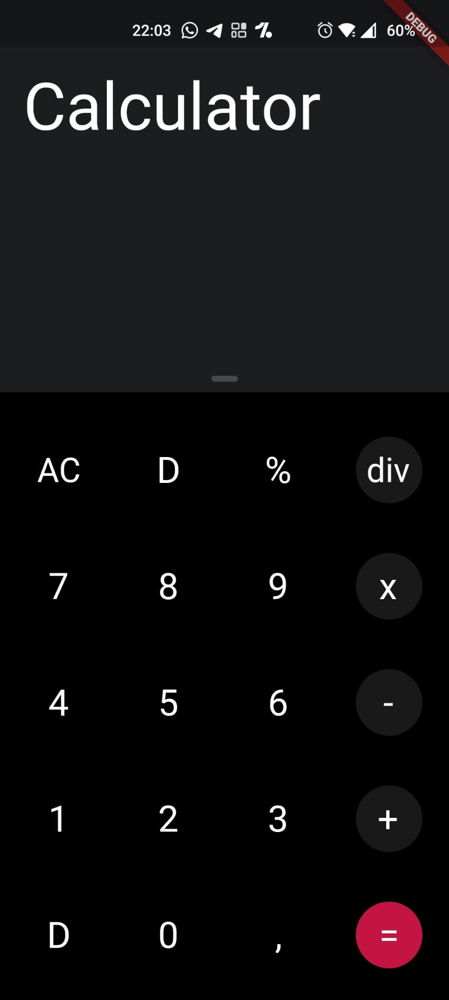
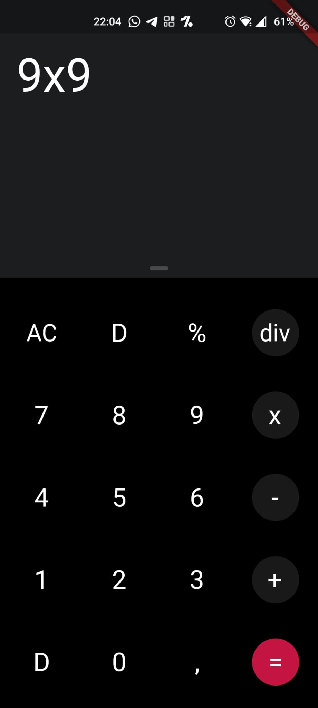
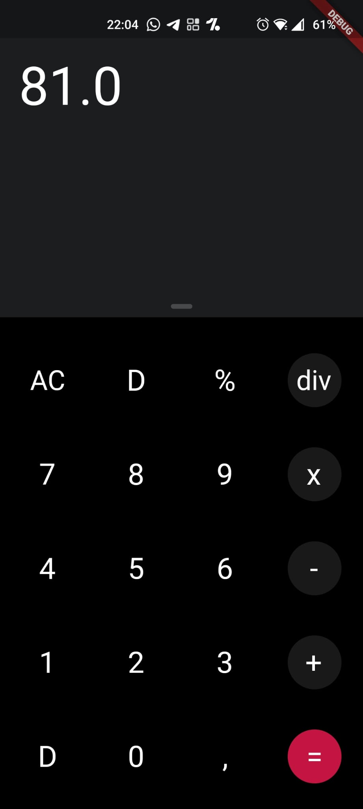
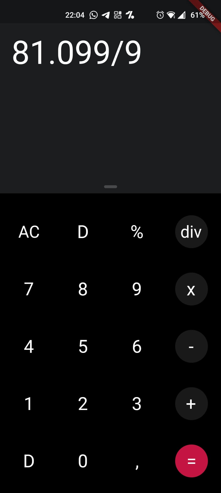

# calculator_bloc

One Plus Calculator in Flutter

## Descr
This application is create for watching bloc-pattern and structure package for beginners.
It's have many bug/problem but the final challenge are the good way of Flutter's patterns.

Good bye and keep programming!

